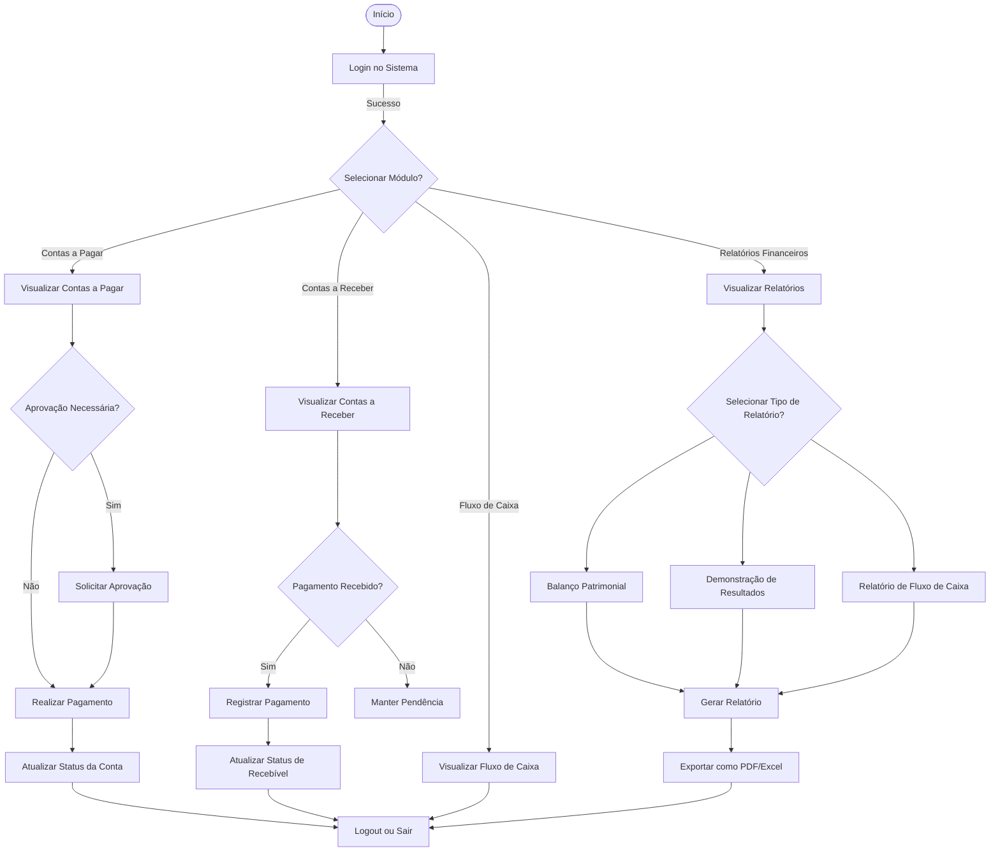

# SUMÁRIO EXECUTIVO

## Visão
O Sistema Mugiwara visa ser uma solução completa e integrada para a gestão financeira de empresas, centralizando funções críticas como contas a pagar e receber, fluxo de caixa, controle orçamentário e relatórios financeiros. A proposta é automatizar processos manuais, garantir a precisão dos dados e fornecer informações estratégicas para apoiar a tomada de decisões, melhorando a eficiência operacional e assegurando conformidade com regulamentações. O sistema é modular e escalável, permitindo que desde trabalhadores autônomos até grandes empresas adotem a plataforma conforme suas necessidades.
Entre as principais características do sistema, destaca-se a interface amigável, que oferece dashboards personalizáveis e permite uma navegação fácil pelos dados financeiros. A modularidade do sistema permite que a empresa implemente apenas os módulos necessários, como Contas a Pagar, Contas a Receber, Fluxo de Caixa e Relatórios Financeiros, com a flexibilidade para expandir conforme as necessidades crescem. A automação é um dos pilares do sistema, eliminando tarefas manuais, como a geração de relatórios e a conciliação bancária, o que reduz a carga de trabalho e o risco de erros humanos. O sistema é também escalável, capaz de se adaptar ao crescimento da empresa e suportar grandes volumes de transações. Além disso, ele oferece segurança avançada com criptografia de dados, controle de acesso baseado em funções e auditoria completa das transações, garantindo conformidade com as regulamentações financeiras e proteção contra fraudes.
A geração de relatórios financeiros é uma das funcionalidades mais importantes, permitindo a criação automática de balanços patrimoniais, demonstrações de resultados e análises detalhadas de fluxo de caixa. O sistema também oferece ferramentas de planejamento e controle orçamentário, permitindo a criação de orçamentos, o monitoramento de desvios e a revisão de metas financeiras. A integração com sistemas bancários facilita a conciliação automática de extratos, a realização de pagamentos eletrônicos e o registro de recebimentos, garantindo uma operação financeira integrada e sem falhas.

## Restrições
- Orçamento Limitado: O desenvolvimento do sistema deve se adequar ao orçamento disponível, o que pode limitar a implementação imediata de todas as funcionalidades avançadas.
- Tempo de Implementação: O prazo para a implementação completa precisa ser compatível com as demandas operacionais da empresa.

## Interessados
- Proprietários
- Colaboradores
- Clientes
- Fornecedores

## Análise de Riscos
- Vulnerabilidades de Segurança
- Resistência dos Usuários

## Orçamento Preliminar
- Não foi definido

## Cronograma Preliminar
- O projeto precisa ser concluído em 4 meses.

## Hipoteses do Projeto
- Automação e Redução de Processos Manuais
- Modularidade para Crescimento

## Modelo de Negócio
O modelo de negócio do Sistema Mugiwara será baseado em uma combinação de licenciamento por assinatura (Software as a Service - SaaS) e personalização sob demanda. As empresas pagarão uma taxa mensal ou anual com base no tamanho da organização e na quantidade de usuários ativos. Haverá também a opção de personalização e implementação de módulos adicionais mediante um custo extra, garantindo flexibilidade para diferentes necessidades empresariais. O suporte técnico e as atualizações de segurança serão incluídos no plano de assinatura, enquanto serviços premium, como consultoria financeira e auditoria de processos, estarão disponíveis como serviços adicionais.

# Diagrama de Atividades

# Levantamento e Análise de Requisitos

## Requisitos Funcionais

### Contas a Pagar

1. CRUD de Fornecedores: Permitir a inclusão, edição e exclusão de fornecedores.
2. CRUD de Despesas: Registrar despesas com detalhes como data, valor, categoria e fornecedor.
3. Pagamento de Contas: Facilitar a execução de pagamentos, possibilitando integração com sistemas bancários para conciliação automática.

### Contas a Receber

4. CRUD de Clientes: Incluir, editar e excluir informações de clientes.
5. CRUD de Receitas: Registrar receitas com detalhes como data, valor, categoria e cliente.
6. Registro de Pagamentos: Permitir o registro e conciliação de pagamentos recebidos, com integração para facilitar a conciliação bancária.

### Fluxo de Caixa

7. Visão Geral do Fluxo de Caixa: Exibir um resumo das entradas e saídas de caixa.
8. Projeção de Fluxo de Caixa: Permitir a criação de previsões baseadas em lançamentos futuros.

### Relatórios Financeiros

9. Geração de Relatórios: Produzir balanços patrimoniais, demonstrações de resultados e análises de fluxo de caixa.
10. Exportação de Relatórios: Oferecer a opção de exportar relatórios em formatos como PDF e Excel.

### Automação de Processos

11. Geração de Relatórios: Automatizar a criação de relatórios financeiros.
12. Conciliação Bancária: Automatizar a conciliação de extratos bancários com os lançamentos financeiros.
13. Pagamentos Eletrônicos: Facilitar a realização de pagamentos eletrônicos diretamente pelo sistema.

### Integração com Sistemas Bancários

14. Importação de Extratos: Integrar com sistemas bancários para importar extratos automaticamente.
15. Registro de Recebimentos e Pagamentos: Facilitar o registro e a conciliação de transações bancárias no sistema.

## Requisitos Não Funcionais

### Segurança

- Criptografia de Dados: Implementar criptografia para proteger dados financeiros sensíveis.
- Controle de Acesso Baseado em Funções: Garantir que os usuários tenham acesso apenas às funções e dados para os quais estão autorizados.
- Auditoria de Transações: Registrar todas as transações e alterações para garantir a conformidade e rastreabilidade.

### Usabilidade

- Interface Amigável: Desenvolver uma interface intuitiva e fácil de usar.
- Navegação: Garantir uma navegação fluida e eficiente através dos diferentes módulos e funcionalidades do sistema.

### Desempenho

- Escalabilidade: Assegurar que o sistema possa lidar com grandes volumes de transações e crescer conforme a empresa se expande.
- Tempo de Resposta: Garantir tempos de resposta rápidos para consultas e geração de relatórios.

### Manutenibilidade

- Modularidade: Desenvolver o sistema de forma modular para facilitar a implementação, manutenção e expansão.
- Documentação: Fornecer documentação adequada para suportar a implementação e manutenção do sistema.

### Compatibilidade

- Integração: Garantir que o sistema possa se integrar com outros softwares financeiros e bancários existentes.

### Regulamentação

- Conformidade: Assegurar que o sistema esteja em conformidade com as regulamentações financeiras e fiscais vigentes.

# Detalhamento dos Requisitos

|RF1. CRUD de Fornecedores|
|-----------------------|
|Descrição: Permitir a criação, edição, visualização e exclusão de fornecedores, com informações, como nome, CNPJ, e contato.|
|Fontes: Departamento financeiro.|
|Usuários: Funcionários do setor financeiro, administradores.|
|Informações de entrada: Nome do fornecedor, CNPJ, telefone, e-mail.|
|Informações de saída: Lista de fornecedores, dados atualizados do fornecedor.|
|Requisitos não funcionais: Tempo de resposta rápido para CRUD, segurança dos dados (criptografia).|

|RF2. CRUD de Despesas|
|-----------------------|
|Descrição: Criar, editar, visualizar e excluir despesas detalhadas, como data, valor, categoria e fornecedor vinculado.|
|Fontes: Documentos fiscais, fornecedores.|
|Usuários: Funcionários do setor financeiro, administradores.|
|Informações de entrada: Data, valor, categoria, fornecedor.|
|Informações de saída: Relatórios de despesas, histórico de despesas por fornecedor.|
|Requisitos não funcionais: Interface intuitiva, tempo de resposta rápido.|

|RF3. Pagamento de Contas|
|-----------------------|
|Descrição: Facilitar a execução de pagamentos de contas, com integração a sistemas bancários para conciliação automática.|
|Fontes: Contas a pagar, fornecedores.|
|Usuários: Funcionários do setor financeiro, administradores.|
|Informações de entrada: Conta a pagar, dados de pagamento (valor, data).|
|Informações de saída: Confirmação de pagamento, extrato bancário conciliado|
|Requisitos não funcionais: Alta disponibilidade, segurança (integração bancária segura).|

|RF4. CRUD de Clientes|
|-----------------------|
|Descrição: criar, editar, visualizar e excluir informações de clientes.|
|Fontes: Clientes.|
|Usuários: Funcionários do setor de vendas, financeiro, administradores.|
|Informações de entrada: Nome, CNPJ/CPF, endereço, telefone, e-mail.|
|Informações de saída: Lista de clientes, dados atualizados do cliente.|
|Requisitos não funcionais: Segurança dos dados, conformidade com LGPD.|

|RF5. CRUD de Receitas|
|-----------------------|
|Descrição: Criar, editar, visualizar e excluir receitas com detalhes como data, valor, categoria e cliente.|
|Fontes: Contratos, vendas realizadas.|
|Usuários: Funcionários do setor financeiro, administradores.|
|Informações de entrada: Data, valor, categoria, cliente.|
|Informações de saída: Relatórios de receitas.|
|Requisitos não funcionais: Interface de fácil navegação, confiabilidade dos dados.|

|RF6. Registro de Pagamentos|
|-----------------------|
|Descrição: Permitir o registro e conciliação de pagamentos recebidos, com integração bancária.|
|Fontes:  Bancos, clientes.|
|Usuários: Funcionários do setor financeiro, administradores.|
|Informações de entrada: Informações de recebimentos (valor, data).|
|Informações de saída: Pagamentos registrados, conciliação bancária.|
|Requisitos não funcionais: Segurança na integração bancária, velocidade na conciliação.|

|RF7. Visão Geral do Fluxo de Caixa|
|-----------------------|
|Descrição: Exibir um resumo em tempo real das entradas e saídas de caixa.|
|Fontes: Registros de contas a pagar e a receber.|
|Usuários: Administradores, gestores financeiros.|Precisão nos cálculos, interface amigável.
|Informações de entrada: Dados financeiros consolidados (entradas e saídas).|
|Informações de saída: Resumo financeiro com gráficos e tabelas.|
|Requisitos não funcionais: Visualização clara, geração rápida dos dados.|

|RF8. Projeção de Fluxo de Caixa|
|-----------------------|
|Descrição: Permitir a criação de previsões de fluxo de caixa baseadas em lançamentos futuros.|
|Fontes: Planejamentos financeiros, contratos futuros|
|Usuários: Gestores financeiros, administradores.|
|Informações de entrada: Lançamentos futuros de receitas e despesas.|
|Informações de saída: Projeção detalhada de entradas e saídas futuras.|
|Requisitos não funcionais: Precisão nos cálculos, interface amigável.|

|RF9. Geração de Relatórios|
|-----------------------|
|Descrição: Gerar relatórios financeiros, como balanços patrimoniais e análises de fluxo de caixa.|
|Fontes: Dados de receitas, despesas e balanço contábil.|
|Usuários: Gestores financeiros, administradores, auditores.|
|Informações de entrada: Período do relatório, tipos de relatório.|
|Informações de saída: Relatórios financeiros completos.|
|Requisitos não funcionais: Formatação padrão de relatórios, facilidade de leitura.|

|RF10. Exportação de relatórios|
|-----------------------|
|Descrição: Oferecer a opção de exportar relatórios em formatos como PDF e Excel.|
|Fontes:  Dados financeiros consolidados.|
|Usuários: Administradores, gestores financeiros.|
|Informações de entrada: Seleção de formato de exportação, período.|
|Informações de saída: Relatório exportado em formato escolhido.|
|Requisitos não funcionais: Exportação rápida.|

|RF11. Geração Automática de Relatórios|
|-----------------------|
|Descrição: Automatizar a criação de relatórios financeiros com base em intervalos de tempo predefinidos.|
|Fontes: Registros financeiros, fluxo de caixa.|
|Usuários: Gestores financeiros, administradores.|
|Informações de entrada: Parâmetros de relatórios (frequência, tipo).|
|Informações de saída: Relatórios gerados automaticamente.|
|Requisitos não funcionais: Automação confiável, baixo consumo de recursos.|

|RF12. Conciliação Bancária|
|-----------------------|
|Descrição: Automatizar a conciliação de extratos bancários com os lançamentos financeiros do sistema.|
|Fontes: Bancos, registros financeiros.|
|Usuários: Funcionários do setor financeiro, administradores.|
|Informações de entrada: Extratos bancários, lançamentos no sistema.|
|Informações de saída: Lançamentos conciliados automaticamente.|
|Requisitos não funcionais: Alta precisão, segurança na integração bancária.|

|RF13. Pagamentos Eletrônicos|
|-----------------------|
|Descrição: Facilitar a realização de pagamentos eletrônicos diretamente pelo sistema.|
|Fontes: Contas a pagar, fornecedores.|
|Usuários: Funcionários do setor financeiro, administradores.|
|Informações de entrada: Dados de pagamento (valor, conta bancária).|
|Informações de saída: Confirmação de pagamento eletrônico.|
|Requisitos não funcionais: Alta segurança nas transações, conformidade com regulamentações bancárias.|

|RF14. Importação de Extratos|
|-----------------------|
|Descrição: Integrar com sistemas bancários para importar extratos automaticamente.|
|Fontes: Bancos.|
|Usuários: Funcionários do setor financeiro, administradores.|
|Informações de entrada: Credenciais bancárias, período de extrato.|
|Informações de saída: Extratos bancários importados.|
|Requisitos não funcionais: Alta disponibilidade da integração, compatibilidade com múltiplos bancos.|

|RF15. Registro de Recebimentos e Pagamentos|
|-----------------------|
|Descrição:  Facilitar o registro e a conciliação de transações bancárias no sistema.|
|Fontes: Bancos, clientes, fornecedores.|
|Usuários: Funcionários do setor financeiro, administradores.|
|Informações de entrada:  Informações das transações bancárias.|
|Informações de saída: Transações registradas e conciliadas.|
|Requisitos não funcionais: Baixo tempo de resposta, segurança dos dados.|
